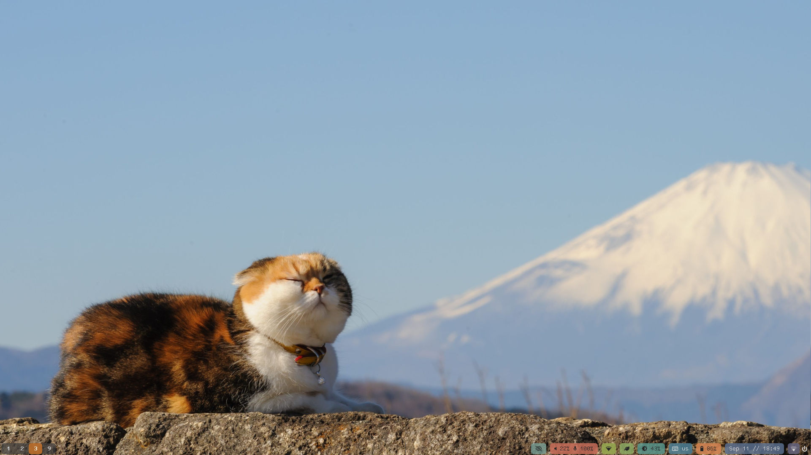
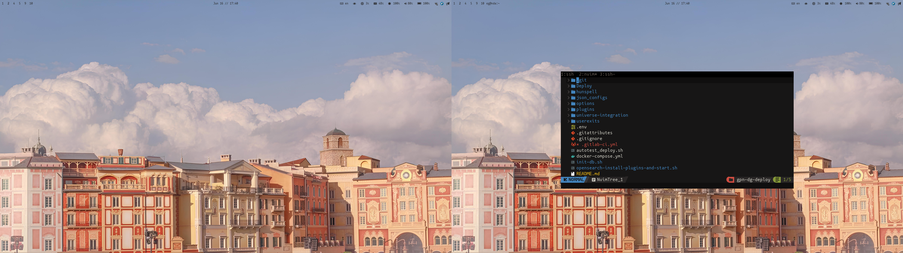
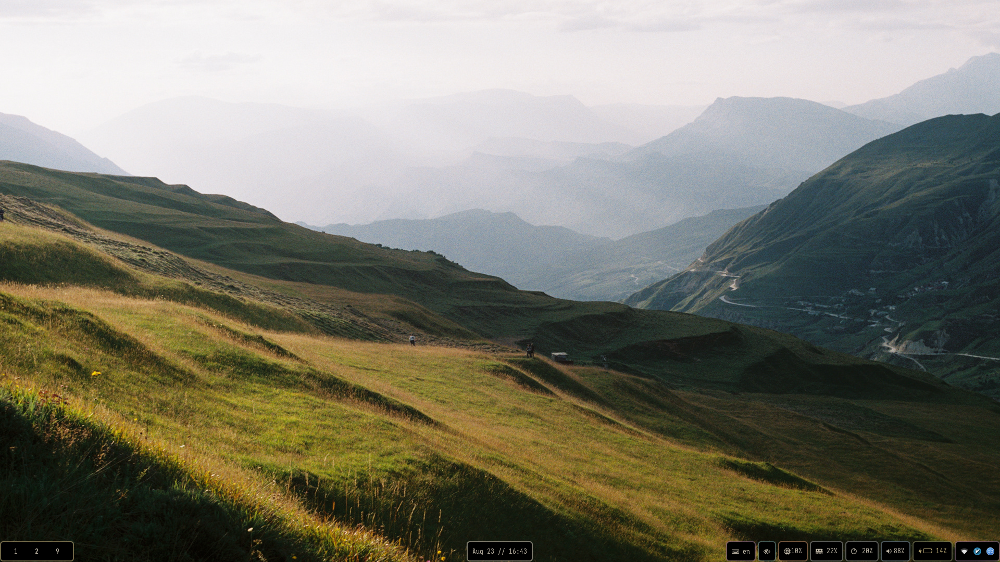
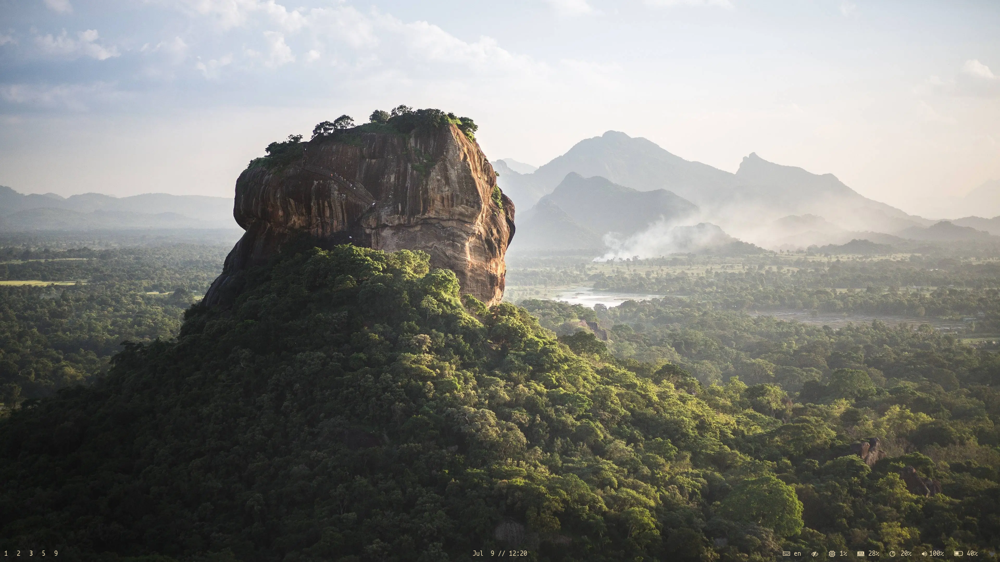
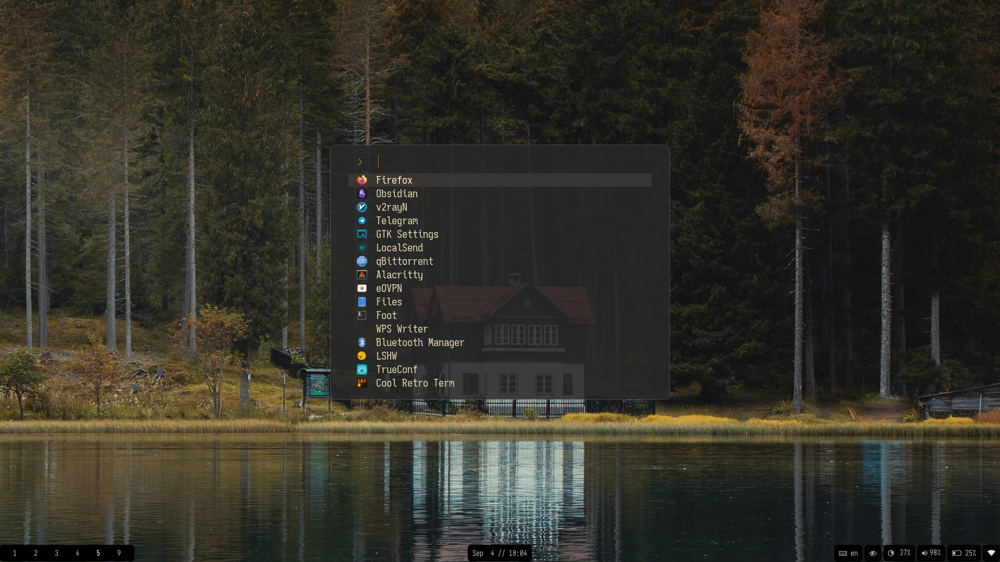

<h2 align="center"> Skemmtilegur screenshots </h2>

<h3 align="center"> [sway] Pisik </h3>

<h3 align="center"> [sway] Cutouts </h3>

<h3 align="center"> [sway] Dagestan </h3>

<h3 align="center"> [sway] Viaje a Sri Lanka </h3>

<h3 align="center"> [sway] Rahat </h3>

<h3 align="center"> [sway] Eg anda </h3>

<h3 align="center"> [sway] Hafldu </h3>

<h3 align="center"> [i3] Kaleidoscope </h3>

<h3 align="center"> [bspwm] Flugufrelsarinn </h3>

<h1 align="center"> Section 2 </h1>
And here there should be another ten or so different themes I hastily put together for my Acer Extensa 5220, HP 15-bs144ur, Digma Fortis M 14, and Lenovo Xiaoxin 14 that I'm not really proud of.
